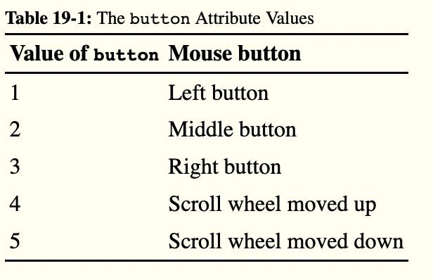
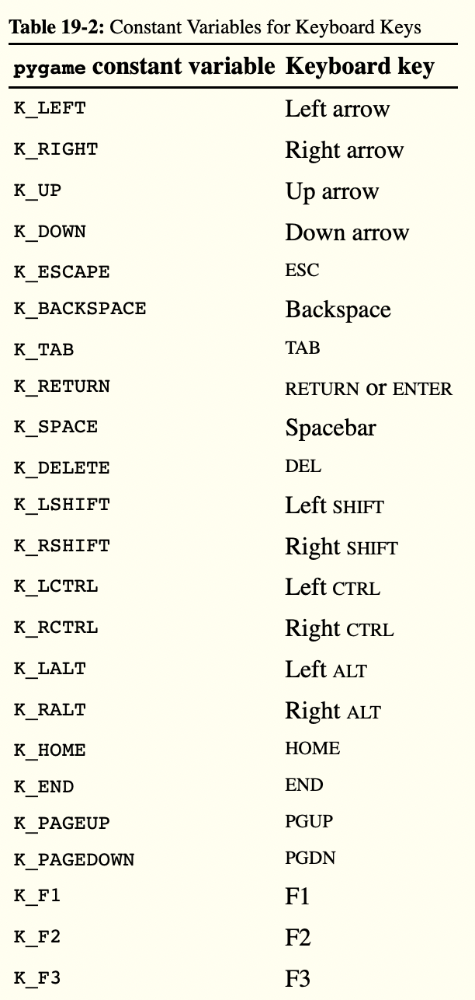
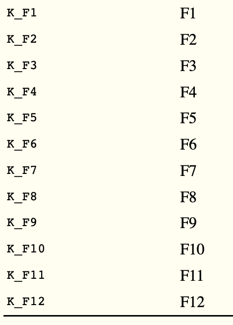

# Pygame Graphics:

## Importing the Modules
The pygame Collision Detection program imports the same modules as the Animation program in Chapter 18, plus the random module:
  1. import pygame, sys, random
  2. from pygame.locals import *

## Using a Clock to Pace the Program
Lines 5 to 17 mostly do the same things that the Animation program did: they initialize pygame, set WINDOWHEIGHT and WINDOWWIDTH, and assign the color and direction constants.
However, line 6 is new:
  6. mainClock = pygame.time.Clock()

In the Animation program, a call to time.sleep(0.02) slowed down the program so that it wouldn’t run too fast. While this call will always pause for 0.02 seconds on all computers, the speed of the rest of the program depends on how fast the computer is. If we want this program to run at the same speed on any computer, we need a function that pauses longer on fast computers and shorter on slow computers.
A pygame.time.Clock object can pause an appropriate amount of time on any computer. Line 110 calls mainClock.tick(40) inside the game loop. This call to the Clock object’s tick() method waits enough time so that it runs at about 40 iterations a second, no matter what the computer’s speed is. This ensures that the game never runs faster than you expect. A call to tick() should appear only once in the game loop.

## Setting Up the Window and Data Structures
Lines 19 to 22 set up a few variables for the food squares that appear on the screen:
19. # Set up the player and food data structures.
20. foodCounter = 0
21. NEWFOOD = 40
22. FOODSIZE = 20

The foodCounter variable will start at the value 0, NEWFOOD at 40, and FOODSIZE at 20. We’ll see how these are used later when we create the food.
Line 23 sets up a pygame.Rect object for the player’s location:
23. player = pygame.Rect(300, 100, 50, 50)

The player variable has a pygame.Rect object that represents the box’s size and position. The player’s box will move like the boxes did in the Animation program (see “Moving Each Box” on page 280), but in this program, the player can control where the box moves.
Next, we set up some code to keep track of the food squares:
24. foods = []
25. for i in range(20):
26.     foods.append(pygame.Rect(random.randint(0, WINDOWWIDTH - FOODSIZE),
          random.randint(0, WINDOWHEIGHT - FOODSIZE), FOODSIZE, FOODSIZE))

The program will keep track of every food square with a list of Rect objects in foods. Lines 25 and 26 create 20 food squares randomly placed around the screen. You can use the random.randint() function to come up with random x- and y-coordinates.
On line 26, the program calls the pygame.Rect() constructor function to return a new pygame.Rect object. It will represent the position and size of a new food square. The first two parameters for pygame.Rect() are the x- and y-coordinates of the top-left corner. You want the random coordinate to be between 0 and the size of the window minus the size of the food square. If you set the random coordinate between 0 and the size of the window, then the food square might be pushed outside of the window altogether, as in Figure 19-2.
The third and fourth parameters for pygame.Rect() are the width and height of the food square. Both the width and height are the values in the FOODSIZE constant.
- The third and fourth parameters for pygame.Rect() are the width and height of the food square. Both the width and height are the values in the FOODSIZE constant.

## Setting Up Variables to Track Movement
Starting at line 29, the code sets up some variables that track the movement of the player’s box for each direction the box can move:
28. # Set up movement variables.
29. moveLeft = False
30. moveRight = False
31. moveUp = False
32. moveDown = False

The four variables have Boolean values to keep track of which arrow key is being pressed and are initially set to False. For example, when the player presses the left arrow key on their keyboard to move the box, moveLeft is set to True. When they let go of the key, moveLeft is set back to False.
Lines 34 to 43 are nearly identical to code in the previous pygame programs. These lines handle the start of the game loop and what to do when the player quits the program. We’ll skip the explanation for this code since we covered it in the previous chapter.

## Handling Events
The pygame module can generate events in response to user input from the mouse or keyboard. The following are the events that can be returned by pygame.event.get():

QUIT Generated when the player closes the window.
KEYDOWN Generated when the player presses a key. Has a key attribute that tells which key was pressed. Also has a mod attribute that tells whether the SHIFT, CTRL, ALT, or other keys were held down when this key was pressed.
KEYUP Generated when the player releases a key. Has key and mod attributes that are similar to those for KEYDOWN.
MOUSEMOTION Generated whenever the mouse moves over the window. Has a pos attribute (short for position) that returns a tuple (x, y) for the coordinates of where the mouse is in the window. The rel attribute also returns an (x, y) tuple, but it gives relative coordinates since the last MOUSEMOTION event. For example, if the mouse moves left by 4 pixels from (200, 200) to (196, 200), then rel will be the tuple value (-4, 0). The button attribute returns a tuple of three integers. The first integer in the tuple is for the left mouse button, the second integer is for the middle mouse button (if one exists), and the third integer is for the right mouse button. These integers will be 0 if they are not being pressed when the mouse is moved and 1 if they are pressed.
MOUSEBUTTONDOWN Generated when a mouse button is pressed in the window. This event has a pos attribute, which is an (x, y) tuple for the coordinates of where the mouse was positioned when the button was pressed. There is also a button attribute, which is an integer from 1 to 5 that tells which mouse button was pressed, as explained in Table 19-1.
MOUSEBUTTONUP Generated when the mouse button is released. This has the same attributes as MOUSEBUTTONDOWN.
When the MOUSEBUTTONDOWN event is generated, it has a button attribute. The button attribute is a value that is associated with the different types of buttons a mouse might have. For instance, the left button has the value 1, and the right button has the value 3. Table 19-1 lists all of the button attributes for mouse events, but note that a mouse might not have all the button values listed here.

## Handling the KEYDOWN Event
The code to handle the keypress and key release events starts on line 44; it includes the KEYDOWN event type:
44.         if event.type == KEYDOWN:

If the event type is KEYDOWN, then the Event object has a key attribute that indicates which key was pressed. When the player presses an arrow key or a WASD key (pronounced wazz-dee, these keys are in the same layout as the arrow keys but on the left side of the keyboard), then we want the box to move. We’ll use if statements to check the pressed key in order to tell which direction the box should move.
Line 46 compares this key attribute to K_LEFT and K_a, which are the pygame.locals constants that represent the left arrow key on the keyboard and the A in WASD, respectively. Lines 46 to 57 check for each of the arrow and WASD keys:
45.             # Change the keyboard variables.
46.             if event.key == K_LEFT or event.key == K_a:
47.                 moveRight = False
48.                 moveLeft = True
49.             if event.key == K_RIGHT or event.key == K_d:
50.                 moveLeft = False
51.                 moveRight = True
52.             if event.key == K_UP or event.key == K_w:
53.                 moveDown = False
54.                 moveUp = True
55.             if event.key == K_DOWN or event.key == K_s:
56.                 moveUp = False
57.                 moveDown = True

When one of these keys is pressed, the code tells Python to set the corresponding movement variable to True. Python will also set the movement variable of the opposite direction to False.
For example, the program executes lines 47 and 48 when the left arrow key has been pressed. In this case, Python will set moveLeft to True and moveRight to False (even though moveRight might already be False, Python will set it to False again just to be sure).
On line 46, event.key can either be equal to K_LEFT or K_a. The value in event.key is set to the same value as K_LEFT if the left arrow key is pressed or the same value as K_a if the A key is pressed.
By executing the code on lines 47 and 48 if the keystroke is either K_LEFT or K_a, you make the left arrow key and the A key do the same thing. The W, A, S, and D keys are used as alternates for changing the movement variables, letting the player use their left hand instead of their right if they prefer. You can see an illustration of both sets of keys in Figure 19-3.
image
Figure 19-3: The WASD keys can be programmed to do the same thing as the arrow keys.

The constants for letter and number keys are easy to figure out: the A key’s constant is K_a, the B key’s constant is K_b, and so on. The 3 key’s constant is K_3. Table 19-2 lists commonly used constant variables for the other keyboard keys.

## Handling the KEYUP Event
When the player releases the key that they were pressing, a KEYUP event is generated:
58.         if event.type == KEYUP:

If the key that the player released was ESC, then Python should terminate the program. Remember, in pygame you must call the pygame.quit() function before calling the sys.exit() function, which we do in lines 59 to 61:
59.             if event.key == K_ESCAPE:
60.                 pygame.quit()
61.                 sys.exit()

Lines 62 to 69 set a movement variable to False if that direction’s key was released:
62.             if event.key == K_LEFT or event.key == K_a:
63.                 moveLeft = False
64.             if event.key == K_RIGHT or event.key == K_d:
65.                 moveRight = False
66.             if event.key == K_UP or event.key == K_w:
67.                 moveUp = False
68.             if event.key == K_DOWN or event.key == K_s:
69.                 moveDown = False

Setting the movement variable to False through a KEYUP event makes the box stop moving.

## Teleporting the Player
You can also add teleportation to the game. If the player presses the X key, lines 71 and 72 set the position of the player’s box to a random place on the window:
70.             if event.key == K_x:
71.                 player.top = random.randint(0, WINDOWHEIGHT -
                      player.height)
72.                 player.left = random.randint(0, WINDOWWIDTH -
                      player.width)

Line 70 checks whether the player pressed the X key. Then, line 71 sets a random x-coordinate to teleport the player to between 0 and the window’s height minus the player rectangle’s height. Line 72 executes similar code, but for the y-coordinate. This enables the player to teleport around the window by pushing the X key, but they can’t control where they will teleport—it’s completely random.

## Adding New Food Squares
There are two ways the player can add new food squares to the screen. They can click a spot in the window where they want the new food square to appear, or they can wait until the game loop has iterated NEWFOOD number of times, in which case a new food square will be randomly generated on the window.
We’ll look at how food is added through the player’s mouse input first:
74.         if event.type == MOUSEBUTTONUP:
75.             foods.append(pygame.Rect(event.pos[0], event.pos[1],
                  FOODSIZE, FOODSIZE))

Mouse input is handled by events just like keyboard input. The MOUSEBUTTONUP event occurs when the player releases the mouse button after clicking it.
On line 75, the x-coordinate is stored in event.pos[0], and the y-coordinate is stored in event.pos[1]. Line 75 creates a new Rect object to represent a new food square and places it where the MOUSEBUTTONUP event occurred. By adding a new Rect object to the foods list, the code displays a new food square on the screen.
In addition to being added manually at the player’s discretion, food squares are generated automatically through the code on lines 77 to 81:
77.     foodCounter += 1
78.     if foodCounter >= NEWFOOD:
79.         # Add new food.
80.         foodCounter = 0
81.         foods.append(pygame.Rect(random.randint(0, WINDOWWIDTH -
              FOODSIZE), random.randint(0, WINDOWHEIGHT - FOODSIZE),
              FOODSIZE, FOODSIZE))

The variable foodCounter keeps track of how often food should be added. Each time the game loop iterates, foodCounter is incremented by 1 on line 77.
Once foodCounter is greater than or equal to the constant NEWFOOD, foodCounter is reset and a new food square is generated by line 81. You can change the rate at which new food squares are added by adjusting NEWFOOD back on line 21.
Line 84 just fills the window surface with white, which we covered in “Handling When the Player Quits” on page 279, so we’ll move on to discussing how the player moves around the screen.

## Moving the Player Around the Window
We’ve set the movement variables (moveDown, moveUp, moveLeft, and moveRight) to True or False depending on what keys the player has pressed. Now we need to move the player’s box, which is represented by the pygame.Rect object stored in player. We’ll do this by adjusting the x- and y-coordinates of player.
86.     # Move the player.
87.     if moveDown and player.bottom < WINDOWHEIGHT:
88.         player.top += MOVESPEED
89.     if moveUp and player.top > 0:
90.         player.top -= MOVESPEED
91.     if moveLeft and player.left > 0:
92.         player.left -= MOVESPEED
93.     if moveRight and player.right < WINDOWWIDTH:
94.         player.right += MOVESPEED

If moveDown is set to True (and the bottom of the player’s box isn’t below the bottom edge of the window), then line 88 moves the player’s box down by adding MOVESPEED to the player’s current top attribute. Lines 89 to 94 do the same thing for the other three directions.

## Drawing the Player on the Window
Line 97 draws the player’s box on the window:
96.     # Draw the player onto the surface.
97.     pygame.draw.rect(windowSurface, BLACK, player)

After the box is moved, line 97 draws it in its new position. The windowSurface passed for the first parameter tells Python which Surface object to draw the rectangle on. The BLACK variable, which has (0, 0, 0) stored in it, tells Python to draw a black rectangle. The Rect object stored in the player variable tells Python the position and size of the rectangle to draw.

## Checking for Collisions
Before drawing the food squares, the program needs to check whether the player’s box has overlapped with any of the squares. If it has, then that square needs to be removed from the foods list. This way, Python won’t draw any food squares that the box has already eaten.
We’ll use the collision detection method that all Rect objects have, colliderect(), in line 101:
 99.     # Check whether the player has intersected with any food squares.
100.     for food in foods[:]:
101.         if player.colliderect(food):
102.             foods.remove(food)

On each iteration through the for loop, the current food square from the foods (plural) list is placed in the variable food (singular). The colliderect() method for pygame.Rect objects is passed the player rectangle’s pygame.Rect object as an argument and returns True if the two rectangles collide and False if they do not. If True, line 102 removes the overlapping food square from the foods list.

## Drawing the Food Squares on the Window
The code on lines 105 and 106 is similar to the code we used to draw the black box for the player:
104.     # Draw the food.
105.     for i in range(len(foods)):
106.         pygame.draw.rect(windowSurface, GREEN, foods[i])

Line 105 loops through each food square in the foods list, and line 106 draws the food square onto windowSurface.
Now that the player and food squares are on the screen, the window is ready to be updated, so we call the update() method on line 109 and finish the program by calling the tick() method on the Clock object we created earlier:
108.     # Draw the window onto the screen.
109.     pygame.display.update()
110.     mainClock.tick(40)

The program will continue through the game loop and keep updating until the player quits.

